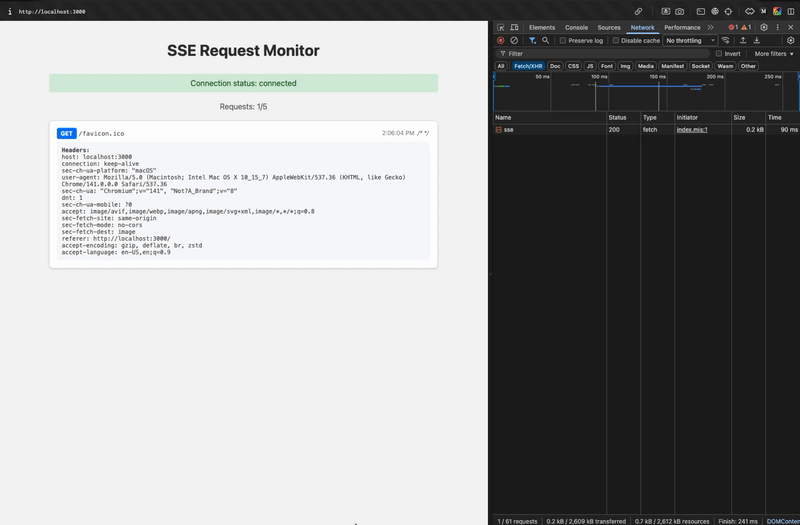

# SSE Server

A **Server-Sent Events (SSE) monitoring tool** that creates a real-time HTTP request monitoring dashboard. This project demonstrates how to build an SSE server and integrate it with the `@neabyte/sse-client` library.

<div align="center">
  
</div>

## 📦 Installation

```bash
# Clone the repository
git clone https://github.com/NeaByteLab/SSE-Server.git
cd SSE-Server

# Install dependencies
npm install

# Start the server
npm start
```

## 🎯 Quick Start

1. **Start the SSE Server**:
   ```bash
   npm start
   ```
   Server will run on `http://localhost:3000`

2. **Open the Dashboard**:
   Navigate to `http://localhost:3000` in your browser

3. **Send Test Requests**:
   ```bash
   # Run the test script
   ./run.sh

   # Or send individual requests
   curl -X POST http://localhost:3000/api/test -H "Content-Type: application/json" -d '{"test": "data"}'
   ```

4. **Watch Real-time Updates**:
   Requests will appear instantly in the dashboard with full details

---

## 🏗️ Architecture

### Server-Side (`src/index.ts`)

```typescript
// EventEmitter for managing SSE connections
const eventEmitter: EventEmitter = new EventEmitter()
const clientConnections: ServerResponse[] = []

// SSE endpoint handler
if (req.url === '/sse') {
  res.writeHead(200, {
    'Content-Type': 'text/event-stream',
    'Cache-Control': 'no-cache',
    Connection: 'keep-alive'
  })
  clientConnections.push(res)
  res.write('data: Connected\n\n')
}

// HTTP request capture and broadcast
eventEmitter.emit('http-request', {
  method: req.method,
  url: req.url,
  headers: req.headers,
  body: body
})
```

### Client-Side (`index.html`)

```javascript
// Using @neabyte/sse-client CDN
import sseClient from 'https://cdn.jsdelivr.net/npm/@neabyte/sse-client/+esm'

// Configuration with auto-reconnection
const config = {
  retryInterval: 3000,    // Retry every 3 seconds
  retryAttempts: 5,       // Try up to 5 times
  autoReconnect: true,    // Enable auto-reconnection
  timeout: 30000          // 30 second connection timeout
}

// Create SSE client
const client = sseClient('/sse', (message) => {
  // Handle incoming messages
  if (message.event === 'http-request') {
    // Display request in UI
  }
}, config)
```

## 🔧 API Endpoints

| Endpoint | Method | Description |
|----------|--------|-------------|
| `/` | GET | Serves the monitoring dashboard |
| `/sse` | GET | SSE endpoint for real-time updates |
| `/*` | ANY | Captures all other requests and broadcasts them |

## 📊 SSE Client Integration

This project demonstrates integration with the **@neabyte/sse-client** library:

### CDN Usage
```html
<script type="module">
  import sseClient from 'https://cdn.jsdelivr.net/npm/@neabyte/sse-client/+esm'

  const client = sseClient('/sse', (message) => {
    console.log('SSE Response:', message)
  })
</script>
```

---

## 📄 License

This project is licensed under the MIT License - see the [LICENSE](LICENSE) file for details.
